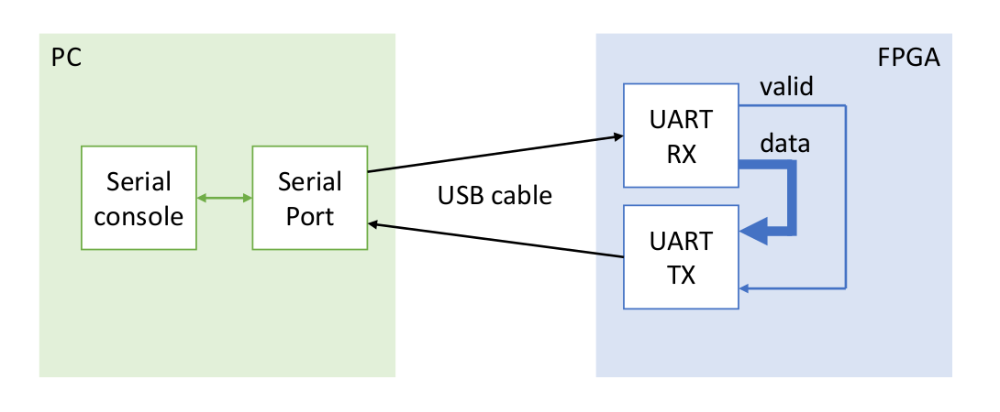

# UART Implementation on FPGA using VHDL (Vivado)

## Overview

This repository contains the VHDL code and associated files for implementing a UART (Universal Asynchronous Receiver-Transmitter) on an FPGA using Vivado. 
The UART module in this project is designed to facilitate serial communication between the FPGA and external devices. It allows for asynchronous communication, making it versatile and suitable for various applications such as interfacing with microcontrollers, sensors, or other FPGA-based systems.

## Prerequisites

Before getting started, ensure you have the following:

- Xilinx Vivado installed on your development machine.
- An FPGA development board supported by Vivado.
- Basic knowledge of VHDL for FPGA development.

## Implementation Details

The UART module is implemented in VHDL and is structured to provide easy integration into different FPGA projects. 
The module comprises two main components: the transmitter (TX) and the receiver (RX). Each component is structured to handle the serial communication of 8-bit data with the inclusion of a 'start' bit ('0') and a stop bit ('1'). The protocol uses a baud-rate of 115200 bps. 

### Transmitter (TX)

The transmitter component adheres to the following schematic representation:

Inputs:

    - Clock: Internal clock of the FPGA (remember to specify it in the constraint file when implementing the module on the FPGA).
    - Data Valid: A std_logic signal; when '1', it indicates the start of data transmission.
    - Data: A std_logic_vector (8 bits) representing the data to be serially transmitted.

Outputs:

    - Busy: A std_logic signal; when '1', it indicates that the transmitter is actively sending data.
    - UART TX: A std_logic signal; the transmitted data (1 bit at a time).

### Receiver (RX)

The receiver component is illustrated by the following schematic:

Inputs:

    - Clock: Internal clock of the FPGA 
    - UART RX: A std_logic signal representing the serial input received by the receiver.

Outputs:

    - Data Valid: A std_logic signal; when '1', it signifies that the receiver has gathered all 8 bits of the received message.
    - Data: A std_logic_vector (8 bits) representing the data to be parallelly transmitted.

The sample generator block is essentially a baudrate generator shifted of half baud period, which starts to generate pulses when it receives the 'start' bit as input.

## Testing

Within the 'sim' directory, you'll find VHDL testbenches, denoted by filenames ending in '_tb.vhd', specifically crafted for simulating the UART module along with its integral components (the transmitter and the receiver). Utilize these testbenches as a vital step in verifying the functionality of the UART implementation before proceeding with its deployment onto the FPGA.

When deploying the module on the FPGA, a practical and effective method for testing its functionality is to perform a loopback test, illustrated in the figure below. This closed-loop setup enables a comprehensive assessment of the UART implementation, evaluating both the transmission and reception processes.

